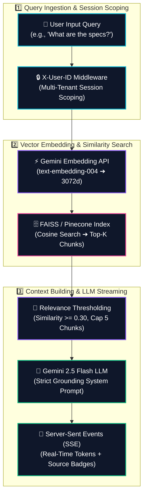

# NexusAI RAG Chatbot 🧠⚡

> **Enterprise AI Knowledge Workspace & RAG Chatbot powered by Retrieval-Augmented Generation**

[](https://github.com/Ganu39/nexusAI-rag-chat-bot/releases)
[](LICENSE)
[](https://nexusai-sage-beta.vercel.app/)
[](https://nexusai-1xq9.onrender.com)
[](https://aistudio.google.com/)

**Stop searching documents. Start asking questions.**  
*Upload PDF, TXT, or DOCX files ➔ Instant FAISS Vector Indexing ➔ Real-Time Token Streaming with Source Citations.*

---

### 📍 Quick Navigation

[Getting Started](#-quick-start-local-setup) · [How It Works](#-end-to-end-rag-pipeline-workflow) · [Features](#-key-features) · [Tech Stack](#-technology-stack) · [Live Demo](https://nexusai-sage-beta.vercel.app/)

---

## 🔄 End-to-End RAG Pipeline Workflow

NexusAI processes every document Q&A query through a structured 6-stage pipeline:



### Execution Stage Matrix

| Stage # | Phase | Icon | Technical Operation | Output / Result | Status |
| :---: | :--- | :---: | :--- | :--- | :---: |
| **1** | **Query Ingest** | 📩 | Scopes request with `X-User-ID` session context and routes casual greetings vs. document queries. | Clean query string | 🟢 Active |
| **2** | **Embedding** | ⚡ | Passes query text to Google Gemini Embedding API (`text-embedding-004`). | `3072d` Vector Array | 🟢 Active |
| **3** | **Vector Search** | 🗄️ | High-speed Cosine Similarity search across FAISS / Pinecone vector database. | Top-K (k=5) Chunks | 🟢 Active |
| **4** | **Context Building**| 🎯 | Filters weak matches (< 0.30 score) & packages text into structured context blocks. | Grounded Context | 🟢 Active |
| **5** | **LLM Synthesis** | 🧠 | Sends isolated context + strict grounding instructions to `gemini-2.5-flash`. | Streamed Tokens | 🟢 Active |
| **6** | **SSE Citations** | 📡 | Streams tokens live via Server-Sent Events with interactive source citation cards. | Cited Answer | 🟢 Active |

---

## 🌟 Key Features

* **3D Interactive Mascot (`Nexus_Bot`)** — WebGL-powered 3D robot mascot avatar with dark-mode obsidian glassmorphism UI.
* **First-Time User Onboarding Popup** — Interactive *"What should we call you?"* modal with persistent user identity memory.
* **Grounded Answer Generation** — Answers derived strictly from uploaded documents with zero speculation.
* **Spacious Markdown Formatting** — Formatted bullet lists, cyan headers, and inline skill badges.
* **Real-Time Token Streaming (SSE)** — Fast typethrough streaming powered by Server-Sent Events.
* **Multi-Format Extraction** — Full support for PDF, TXT, and DOCX document formats with page-number tracking.
* **Dual Vector Database Engine** — Local CPU **FAISS** index by default, with optional cloud **Pinecone** integration.
* **Workspace Data Isolation** — `X-User-ID` session header ensuring zero cross-tenant data leakage between users.
* **Interactive Source Citations** — Clickable citation badges with raw text snippet modal inspection.

---

## 🛠️ Technology Stack

| Layer | Technologies |
| :--- | :--- |
| **Frontend** | Next.js 15, React 18, TypeScript, Tailwind CSS, Framer Motion, Lucide Icons |
| **Backend API** | FastAPI, Python 3.11+, Pydantic v2, Uvicorn |
| **AI & RAG** | Google Gemini (`gemini-2.5-flash`), Gemini Embeddings (`text-embedding-004`), FAISS, Pinecone |
| **Deployments** | Vercel (Frontend), Render (Backend), GitHub Actions CI |

---

## 🚀 Quick Start (Local Setup)

### 1. Backend Setup
```bash
cd backend
python -m venv venv
venv\Scripts\activate  # Windows
pip install -r requirements.txt
uvicorn app.main:app --reload --port 8000
```

### 2. Frontend Setup
```bash
cd frontend
npm install
npm run dev
```
Open **[http://localhost:3000](http://localhost:3000)** in your browser!

---

<p align="center">Built with ❤️ by the NexusAI Team</p>
