# NexusAI RAG Chatbot 🧠⚡

> **Enterprise AI Knowledge Workspace & RAG Chatbot powered by Retrieval-Augmented Generation**

[](https://github.com/Ganu39/nexusAI-rag-chat-bot/releases)
[](LICENSE)
[](https://nexusai-sage-beta.vercel.app/)
[](https://nexusai-1xq9.onrender.com)
[](https://aistudio.google.com/)

**Stop searching documents. Start asking questions.**  
*Upload PDF, TXT, or DOCX files ➔ Instant FAISS Vector Indexing ➔ Real-Time Token Streaming with Source Citations.*

---

### 📍 Quick Navigation

[Getting Started](#-quick-start-local-setup) · [How It Works](#-end-to-end-rag-pipeline-workflow) · [Features](#-key-features) · [Tech Stack](#-technology-stack) · [Live Demo](https://nexusai-sage-beta.vercel.app/)

---

## 🔄 End-to-End RAG Pipeline Workflow

NexusAI processes every document Q&A query through a structured 6-stage pipeline:

```mermaid
flowchart LR
    classDef cyanNode fill:#0f172a,stroke:#06b6d4,stroke-width:2px,color:#fff;
    classDef purpleNode fill:#0f172a,stroke:#8b5cf6,stroke-width:2px,color:#fff;
    classDef pinkNode fill:#0f172a,stroke:#ec4899,stroke-width:2px,color:#fff;
    classDef emeraldNode fill:#0f172a,stroke:#10b981,stroke-width:2px,color:#fff;

    A["👤 1. User Query"]:::cyanNode --> B["🔒 2. X-User-ID Scope"]:::cyanNode
    B --> C["⚡ 3. Gemini Embedding (3072d)"]:::purpleNode
    C --> D["🗄️ 4. Cosine Search (FAISS/Pinecone)"]:::pinkNode
    D --> E["🎯 5. Relevance Filter (Score >= 0.30)"]:::emeraldNode
    E --> F["🧠 6. Gemini 2.5 Flash LLM"]:::emeraldNode
    F --> G["📡 7. SSE Token Stream & Citations"]:::emeraldNode
```



### Execution Stage Matrix

| Stage # | Phase | Icon | Technical Operation | Output / Result | Status |
| :---: | :--- | :---: | :--- | :--- | :---: |
| **1** | **Query Ingest** | 📩 | Validates query text & routes casual greetings vs. document queries. | Clean query string | 🟢 Active |
| **2** | **Session Scope** | 🔒 | Attaches `X-User-ID` session context ensuring multi-tenant workspace isolation. | User-scoped session | 🟢 Active |
| **3** | **Embedding** | ⚡ | Converts query text into a high-dimensional vector via Google Gemini (`text-embedding-004`). | `3072d` Vector Array | 🟢 Active |
| **4** | **Vector Search** | 🗄️ | High-speed Cosine Similarity search across FAISS / Pinecone vector database. | Top-K (k=5) Chunks | 🟢 Active |
| **5** | **Context Building**| 🎯 | Filters weak matches (< 0.30 score) & formats text into structured context blocks. | Grounded Context | 🟢 Active |
| **6** | **LLM Synthesis** | 🧠 | Sends isolated context + strict grounding instructions to `gemini-2.5-flash`. | Streamed Tokens | 🟢 Active |
| **7** | **SSE & Citations**| 📡 | Streams tokens live via Server-Sent Events with interactive source citation cards. | Cited Answer | 🟢 Active |

---

## 🌟 Core RAG & AI Features

* **Grounded Answer Synthesis** — Synthesizes accurate responses grounded exclusively in uploaded document context with zero speculation or hallucinations.
* **Real-Time Token Streaming (SSE)** — High-speed typethrough token streaming powered by Server-Sent Events (`POST /api/v1/ask/stream`).
* **High-Dimensional Vector Embeddings** — Converts text into `3072-dimensional` semantic vectors using Google Gemini (`text-embedding-004`).
* **Dual Vector Database Engine** — Zero-cost local CPU **FAISS** index by default, with optional managed cloud **Pinecone** index via toggle.
* **Page-Aware Multi-Format Extraction** — Native extractors for `PDF`, `TXT`, and `DOCX` files with exact page-number tracking.
* **Relevance Thresholding & Context Building** — Filters weak matches (similarity score < 0.30) and packages top-K relevant chunks into strict prompts.

---

## ✨ Key User Experience & Security Features

* **3D Interactive Mascot Avatar (`Nexus_Bot`)** — WebGL-powered 3D robot mascot head avatar with glowing digital cyan eyes and dark studio UI.
* **First-Time User Onboarding Popup** — Interactive *"What should we call you?"* modal with persistent `localStorage` user memory and edit pencil icon.
* **Workspace Data Isolation (`X-User-ID`)** — Client session header scoping document listings and vector search to ensure zero cross-tenant data leakage.
* **Interactive Source Citation Snippets** — Clickable source badges displaying filename, page number, match score, and raw vector text snippet modal.
* **Spacious Markdown Formatting** — Formatted bullet lists, cyan headers, and inline dark skill badges.
* **Universal Knowledge Base Drawer** — Responsive modal to search, view, upload, and delete indexed vector documents on desktop and mobile.

---

## 🛠️ Technology Stack

| Layer | Technologies |
| :--- | :--- |
| **Frontend** | Next.js 15, React 18, TypeScript, Tailwind CSS, Framer Motion, Lucide Icons |
| **Backend API** | FastAPI, Python 3.11+, Pydantic v2, Uvicorn |
| **AI & RAG** | Google Gemini (`gemini-2.5-flash`), Gemini Embeddings (`text-embedding-004`), FAISS, Pinecone |
| **Deployments** | Vercel (Frontend), Render (Backend), GitHub Actions CI |

---

## 🚀 Quick Start (Local Setup)

### 1. Backend Setup
```bash
cd backend
python -m venv venv
venv\Scripts\activate  # Windows
pip install -r requirements.txt
uvicorn app.main:app --reload --port 8000
```

### 2. Frontend Setup
```bash
cd frontend
npm install
npm run dev
```
Open **[http://localhost:3000](http://localhost:3000)** in your browser!

---

<p align="center">Built with ❤️ by the NexusAI Team</p>
