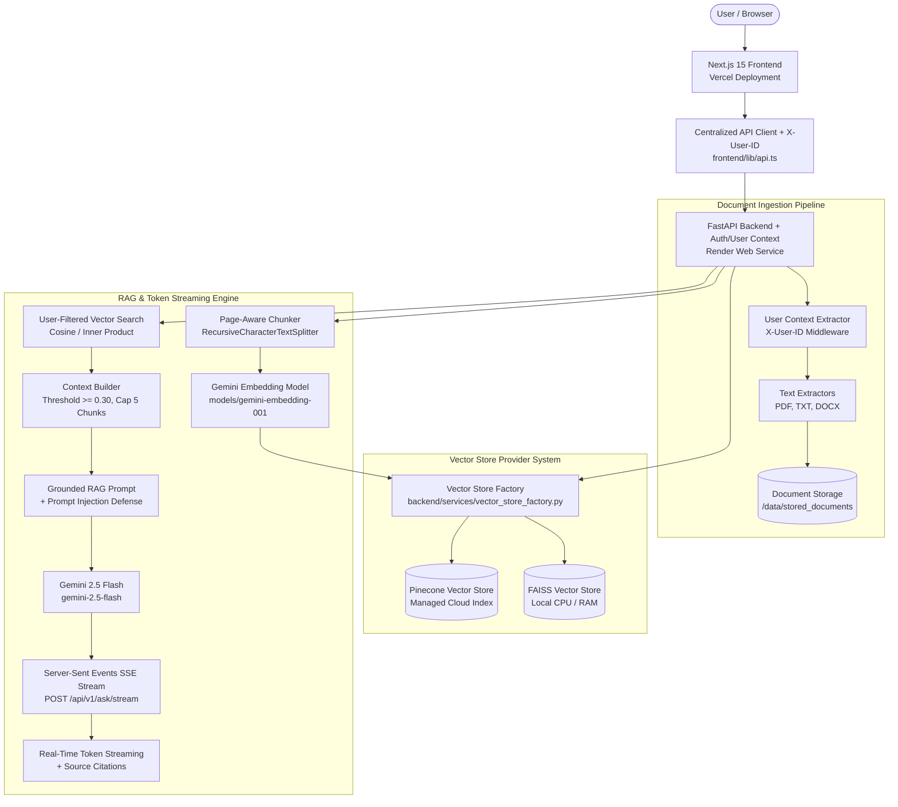
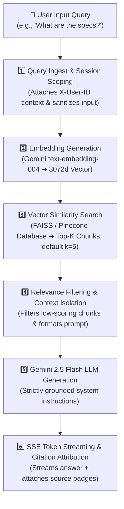

# NexusAI 🧠⚡

> **STATUS:** `PHASE 5 — COMPLETED`

[](https://github.com/Ganu39/NexusAI/releases/tag/v0.5.0)
[](PROJECT_STATE.md)
[](#-security--privacy-architecture-report)
[](#-user-data-privacy--workspace-isolation)
[](https://nexusai-sage-beta.vercel.app/)
[](https://nexusai-1xq9.onrender.com)
[](LICENSE)

NexusAI is an enterprise-grade AI Knowledge Workspace powered by Retrieval-Augmented Generation (RAG). It enables organizations and teams to ingest, index, and query document repositories using state-of-the-art AI models, producing verified answers grounded exclusively in user-uploaded data with precise source citations.

The core production RAG pipeline has been verified end-to-end in production:
```
Document Upload ➔ Text Extraction ➔ Vector Indexing ➔ FAISS/Pinecone Retrieval ➔ Real-Time Token Streaming (SSE) ➔ Grounded Answer + Citations
```

---

## 📌 Overview

NexusAI bridges local document stores and cloud LLMs via a decoupled, privacy-first architecture:
- **Production Frontend (Vercel):** `https://nexusai-sage-beta.vercel.app/`
- **Production Backend (Render):** `https://nexusai-1xq9.onrender.com`

Users upload PDF, TXT, or DOCX documents, which are extracted into structured text, split into page-aware semantic chunks, embedded using Google Gemini, and indexed into a local FAISS or Pinecone cloud vector store. When users ask questions in the Grounded RAG Chat interface, the system streams tokens in real-time and synthesizes accurate, cited answers.

---

## 🔒 User Data Privacy & Workspace Isolation

NexusAI is built with **privacy-by-design** and **multi-tenant workspace micro-isolation**:

### 1. Client-Side Workspace Identity (`User ID`)
- **Automatic Session ID**: Every browser session receives a unique `User ID` (e.g., `usr_9x8a7b_1787330`) saved in `localStorage`.
- **Custom Workspace Choice**: Users can set custom workspace names (e.g., `company_project`, `team_alpha`) on the `/settings` page to create or switch between private workspaces.
- **Transport Security**: All API calls from the frontend include the `X-User-ID` header.

### 2. Micro-Isolated Storage Layer
- Document metadata JSON files (`/data/stored_documents/*.json`) include a `"user_id"` tag.
- The document listing API (`GET /api/v1/documents`) filters stored documents on the backend using `doc.user_id == current_user_id`. Users can only view and manage their own uploaded files.

### 3. Vector Search Isolation (Zero Cross-Tenant Leakage)
- Both local **FAISS** and cloud **Pinecone** vector search engines filter candidate vector matches by `user_id`.
- Even when multiple users upload documents to the same server, vector search filters out any candidate chunk that does not belong to the requesting user's `User ID`. User A can **never** search or view User B's documents.

---

## 🛡️ Security & Privacy Architecture Report

### Threat Defenses & Privacy Protections

1. **Strict File Upload Whitelist**: Only validated file extensions (`.pdf`, `.txt`, `.docx`) and MIME types are allowed. Unsupported files are rejected immediately.
2. **Anti-Path Traversal Sanitization**: Filenames pass through `sanitize_filename()` regex filtering (`re.sub(r"[^a-zA-Z0-9_.-]", "_", base)`). Traversal strings (`../`, `..\\`) are stripped to prevent arbitrary file overwrite attacks.
3. **Transient Temp File Cleanup**: Temporary uploaded files are stored in a isolated temporary directory and deleted immediately after text extraction in execution `finally` blocks.
4. **CORS Protection**: The backend configures `CORSMiddleware` restricting cross-origin HTTP requests strictly to allowed production domain `https://nexusai-sage-beta.vercel.app`.
5. **API Key Header Authentication (Optional)**: Supports `X-API-Key` verification via `backend/middleware/auth.py`. When `NEXUSAI_API_KEY` is configured in production, unauthorized requests are blocked with `HTTP 401 Unauthorized`.
6. **Prompt Injection Defense**: RAG answer generation uses a strict system instruction prompt (`RAG_SYSTEM_INSTRUCTION`). Context chunks are wrapped in `<context>` block tags, preventing malicious document text from overriding system directives or exfiltrating data.

### Security & Privacy Summary Matrix

| Defense Vector | Implementation Strategy | Status |
| :--- | :--- | :--- |
| **Workspace Data Isolation** | Client `X-User-ID` header + FAISS/Pinecone vector filtering | **Active & Enforced** |
| **Cross-Tenant Leakage Protection** | Backend metadata & similarity search filtering | **Active & Enforced** |
| **File Path Traversal Defense** | Strict regex filename sanitization & base path extraction | **Active & Enforced** |
| **File Type Validation** | MIME type & extension whitelist (`PDF`, `TXT`, `DOCX`) | **Active & Enforced** |
| **CORS Protection** | Domain-restricted `CORSMiddleware` | **Active & Enforced** |
| **Prompt Injection Defense** | Grounded system instructions & context block wrappers | **Active & Enforced** |
| **API Authentication** | Header API key verification (`X-API-Key`) | **Configurable** |

---

## 🏗️ Architecture



---

## 🔄 End-to-End RAG Pipeline Workflow

NexusAI processes every document Q&A query through a structured 6-stage pipeline:



### Execution Stage Matrix

| Stage # | Pipeline Phase | Technical Operation | Output / Result |
| :--- | :--- | :--- | :--- |
| **1** | **Query Ingest** | Validates query text, scopes request to user session (`X-User-ID`), and routes casual greetings vs. document queries. | Clean query string |
| **2** | **Vector Embedding** | Passes query to Google Gemini Embedding API (`text-embedding-004`) to convert text into semantic numerical vectors. | `3072-dimensional` vector array |
| **3** | **FAISS / Pinecone Search** | Performs high-speed Cosine Similarity search across document chunks stored in FAISS / Pinecone vector index. | Top-K (e.g. 5) most relevant document chunks |
| **4** | **Context Building** | Filters out weak matches (similarity < 0.30), formats text chunks into structured context blocks with filename & page numbers. | Isolated document context payload |
| **5** | **Gemini 2.5 Flash** | Sends isolated context + strict grounding prompt + user question to `gemini-2.5-flash`. | Streamed response tokens |
| **6** | **Citations & UI** | Streams tokens live via Server-Sent Events (SSE), marks response as **Grounded Answer**, and attaches clickable source citation cards. | Formatted answer + source chips |

---

## 🌟 Current Features

1. **Interactive Landing Page** — Modern dark-mode UI with hero CTAs, workflow action cards, technology marquee, feature breakdown, and pricing tiers.
2. **Knowledge Workspace Dashboard** — Real-time workspace metrics (Total Documents, Storage Used, Pages Processed, Characters Processed) computed dynamically from backend data.
3. **Document Management Repository** — Interactive document uploader with drag-and-drop support, format validation, real-time title search, file-type filters, and sorting.
4. **PDF, TXT, & DOCX Support** — Format-specific text extractors with page-number tracking and MIME/extension allowlist validation.
5. **Persistent Document State Tracking** — Store and serve `is_indexed` status, `processing_status` (`uploaded`/`indexing`/`indexed`/`failed`), `chunks_created`, and `embeddings_created` metrics across server reboots.
6. **Dual Vector Database Provider System** — Zero-cost local **FAISS** index by default, with optional cloud **Pinecone** index via environment toggle (`VECTOR_STORE_PROVIDER`).
7. **Real-Time Token Streaming (SSE)** — Server-Sent Events endpoint (`POST /api/v1/ask/stream`) streaming Gemini answer tokens live to the frontend with typethrough animation.
8. **Browser Client User ID Workspace Isolation** — Automatic unique User ID generation in `localStorage`, customizable on `/settings`, isolating document stores and vector search queries via `X-User-ID` headers.
9. **Dedicated Workspace Settings Page (`/settings`)** — Workspace User ID management, copy/customization/reset controls, live system telemetry metrics, and chat cache maintenance.
10. **System Telemetry Metrics API** — `GET /api/v1/metrics` returning active vector provider, document counts, chunk counts, and storage status.
11. **Precise Source Attribution & Snippet Modal** — Grounded answers citing document filename, page number, chunk ID, and similarity score, with an interactive modal displaying raw chunk text.
12. **Chat Session History & Clear Chat** — Persistent conversation history saved in browser `sessionStorage` with a one-click Clear Chat action button.
13. **API Key Security & CORS Defense** — Optional `X-API-Key` header authentication and domain-restricted CORS protection.

---

## 🌐 Production Deployment

| Layer | Platform | URL / Configuration | Persistent Disk |
|---|---|---|---|
| **Frontend** | Vercel | `https://nexusai-sage-beta.vercel.app/` | N/A (Edge CDN) |
| **Backend** | Render | `https://nexusai-1xq9.onrender.com` | Mounted at `/data` |

---

## 🛠️ Technology Stack

| Layer | Technologies |
|---|---|
| **Frontend** | Next.js 15 (App Router), React 18, TypeScript 5, Tailwind CSS 3, Framer Motion, Lucide Icons, Radix UI Primitives |
| **Backend API** | FastAPI 0.110+, Python 3.11+, Pydantic v2, pydantic-settings, Uvicorn |
| **RAG & AI** | Google GenAI SDK (`google.genai`), Gemini Embeddings (`models/gemini-embedding-001`), Gemini LLM (`gemini-2.5-flash`), `langchain-text-splitters`, FAISS (`faiss-cpu`), Pinecone SDK |
| **Document Processing** | `pypdf`, `python-docx` |
| **Hosting & Infra** | Vercel (Frontend), Render (Backend Web Service), GitHub Actions CI |

---

## 📡 Production API Endpoints

| Method | Endpoint | Description | Status |
|---|---|---|---|
| `GET` | `/health` | System health status and configuration verification | ✅ Live |
| `GET` | `/api/v1/metrics` | System telemetry metrics and active vector provider status | ✅ Live |
| `POST` | `/api/v1/upload` | Upload and extract PDF, TXT, or DOCX document | ✅ Live |
| `GET` | `/api/v1/documents` | List metadata summaries of ingested documents for current user | ✅ Live |
| `GET` | `/api/v1/documents/{id}` | Retrieve metadata summary for a specific document | ✅ Live |
| `POST` | `/api/v1/documents/{id}/index` | Chunk, embed, and index an ingested document into vector store | ✅ Live |
| `DELETE`| `/api/v1/documents/{id}` | Delete document file and metadata from backend storage | ✅ Live |
| `POST` | `/api/v1/search` | Execute vector similarity search returning top matching chunks | ✅ Live |
| `POST` | `/api/v1/ask` | Execute end-to-end grounded RAG answer generation with citations | ✅ Live |
| `POST` | `/api/v1/ask/stream` | Stream grounded RAG answer tokens live via Server-Sent Events (SSE) | ✅ Live |

---

## 📁 Project Structure

```text
NexusAI/
├── backend/
│   ├── api/                     # FastAPI route handlers
│   │   ├── health.py            # Health check endpoint
│   │   ├── metrics.py           # Telemetry metrics endpoint
│   │   ├── upload.py             # Document upload & repository endpoints
│   │   ├── search.py            # Vector similarity search endpoint
│   │   └── rag.py               # RAG ask & SSE streaming endpoints
│   ├── app/
│   │   └── main.py              # FastAPI application entry & CORS
│   ├── config/
│   │   └── settings.py          # Environment settings & Pydantic validation
│   ├── middleware/
│   │   ├── auth.py              # X-API-Key header authentication
│   │   └── user_context.py      # X-User-ID workspace isolation dependency
│   ├── models/                  # Pydantic data schemas
│   ├── services/
│   │   ├── extractor.py         # PDF, TXT, DOCX text extractors
│   │   ├── chunker.py           # Page-aware text chunking logic
│   │   ├── embedding.py         # Google Gemini embedding client
│   │   ├── vector_store.py      # FAISS local vector store implementation
│   │   ├── vector_store_pinecone.py # Pinecone cloud vector store implementation
│   │   ├── vector_store_factory.py  # Vector store provider factory
│   │   ├── document_store.py    # Persistent JSON storage service
│   │   ├── context_builder.py   # Relevance thresholding & context assembly
│   │   └── llm.py               # Gemini 2.5 Flash RAG answer generator
│   ├── tests/                   # Pytest test suite (57 tests)
│   ├── requirements.txt         # PyPI dependencies
│   └── render.yaml              # Render deployment configuration
├── frontend/
│   ├── app/                     # Next.js App Router pages
│   │   ├── page.tsx             # Interactive Landing Page
│   │   ├── dashboard/page.tsx   # Knowledge Workspace Dashboard
│   │   ├── documents/page.tsx   # Document Repository & Uploader
│   │   ├── chat/page.tsx        # Grounded RAG Q&A Chat (SSE Token Streaming)
│   │   └── settings/page.tsx    # Dedicated Workspace Settings Page
│   ├── components/              # UI & Layout components
│   ├── lib/                     # API client & constants
│   ├── types/                   # TypeScript interfaces
│   └── package.json             # Frontend dependencies
├── README.md                    # Project documentation
└── PROJECT_STATE.md             # Milestone tracking & phase status
```

---

## 🧪 Testing & Verification Status

- **Backend Pytest Suite:** **57 passed** (`python -m pytest`)
- **Backend Code Quality:** **0 lint errors** (`python -m flake8 .`)
- **Frontend Code Quality:** **0 ESLint errors** (`npm run lint`)
- **Frontend Production Build:** **Successful compilation (8/8 static routes)** (`npm run build`)
- **End-to-End Verification:** Live production testing passed across Upload, Indexing, Vector Search, SSE Token Streaming, User ID Workspace Isolation, and Settings.

---

## 📜 Milestone History

- **Phase 1 — Backend Foundation:** Core FastAPI server structure, configuration management, health endpoints, and initial test suite. — **COMPLETED**
- **Phase 2 — RAG Backend Pipeline:** Document extractors (PDF, TXT, DOCX), page-aware chunker, Gemini embeddings, FAISS vector store, context builder, and grounded answer synthesis. — **COMPLETED**
- **Phase 3 — Frontend & Production Deployment:** Integrated Next.js frontend, document listing, indexing, deletion, RAG chat, Vercel frontend deployment, and Render backend deployment. — **COMPLETED**
- **Phase 4 — Production Hardening & RAG Quality:** Persistent document state tracking (`is_indexed`, `chunks_created`, `embeddings_created`), source text snippet viewer modal, real-time title search, file filters, and chat session history. — **COMPLETED**
- **Phase 5 — Advanced Infrastructure & Scale:** Dual Vector Store Factory (FAISS + Pinecone), Server-Sent Events (SSE) token streaming, User ID Workspace Isolation, Workspace Settings Page (`/settings`), API Key Auth, and Metrics Telemetry. — **COMPLETED**

---

<p align="center">Built with ❤️ by the NexusAI Team</p>
