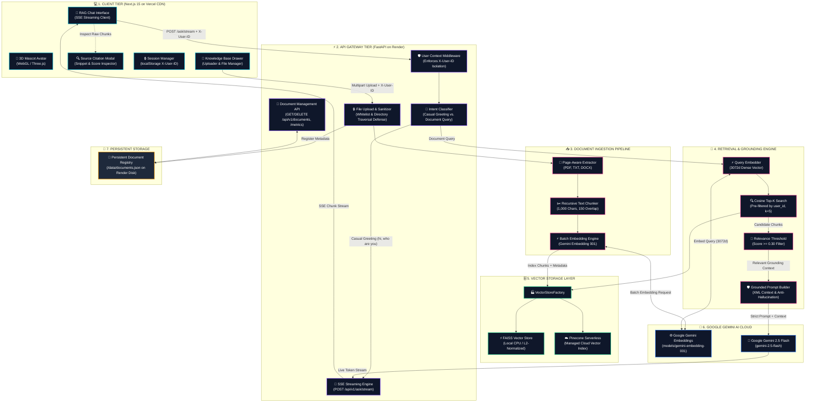
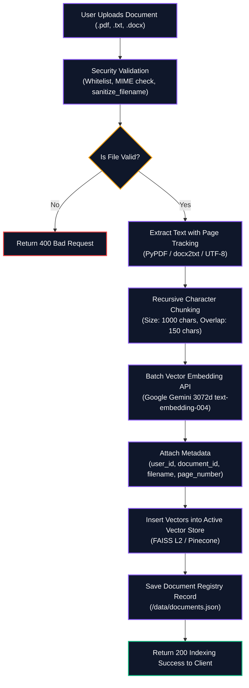
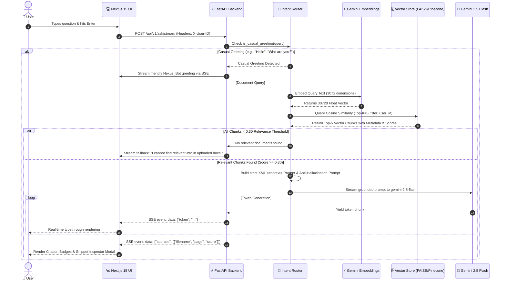
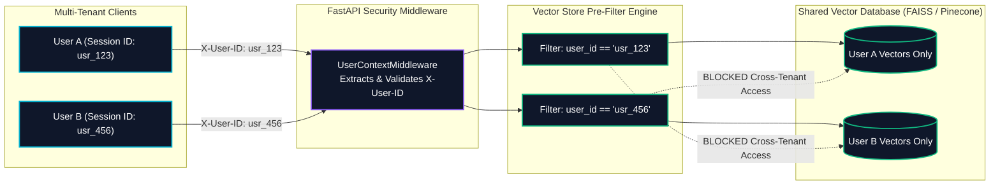
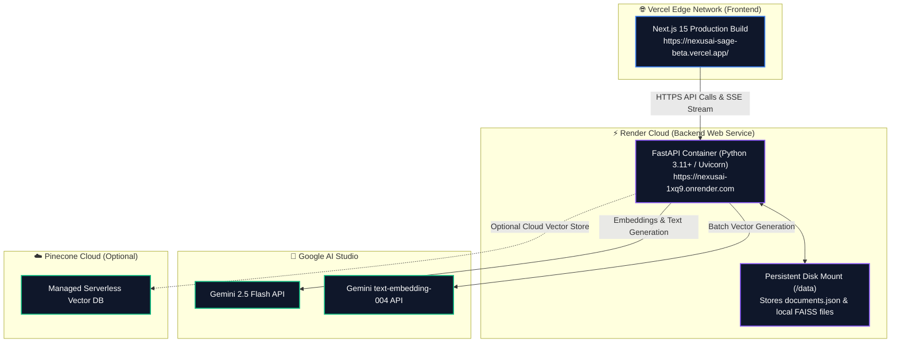

# 🏗️ NexusAI RAG Chatbot — Comprehensive System Architecture

Welcome to the technical architecture guide for **NexusAI RAG Chatbot** — an enterprise-grade AI Knowledge Workspace powered by Retrieval-Augmented Generation (RAG).

This document serves as the single source of truth for the system design, data flows, security boundaries, and includes master prompts for AI visual diagram generators alongside native, renderable Mermaid.js diagrams.

---

## 📑 Table of Contents

1. [Master Architecture Prompt for AI Generators](#-1-master-architecture-prompt-for-ai-generators)
2. [High-Level End-to-End System Architecture (Mermaid)](#-2-high-level-end-to-end-system-architecture)
3. [Document Ingestion Pipeline (Mermaid Flow)](#-3-document-ingestion-pipeline)
4. [Real-Time RAG Query & Streaming Pipeline (Mermaid Sequence)](#-4-real-time-rag-query--streaming-pipeline)
5. [Multi-Tenant Data Isolation & Security Architecture](#-5-multi-tenant-data-isolation--security-architecture)
6. [Component & Subsystem Technical Breakdown](#-6-component--subsystem-technical-breakdown)
7. [Cloud Infrastructure & Deployment Topology](#-7-cloud-infrastructure--deployment-topology)

---

## 📋 1. Master Architecture Prompt for AI Generators

> **Tip:** You can copy and paste the prompt below into AI tools (such as **ChatGPT**, **Claude**, **Eraser.io**, or **Whimsical**) to generate diagrams, whitepapers, or slide decks.

```text
Act as a Principal Cloud & AI Solutions Architect. Generate a comprehensive system architecture diagram for "NexusAI RAG Chatbot" — a production-grade, multi-tenant Retrieval-Augmented Generation (RAG) knowledge workspace.

### 🎨 Visual & Theme Guidelines:
- Style: Modern Dark Studio Glassmorphic UI (Slate #0f172a, Cyan #06b6d4, Purple #8b5cf6, Pink #ec4899, Emerald #10b981, Amber #f59e0b).
- Layout: Multi-Tiered Distributed Architecture (Client Tier -> API Gateway / Backend -> AI RAG Orchestration -> Storage Layer -> External AI Cloud).

### 🧱 Architectural Layers & Components:

1. CLIENT PRESENTATION TIER (Deployed on Vercel CDN):
   - Tech: Next.js 15 (App Router), React 18, TypeScript, Tailwind CSS, Framer Motion.
   - Core Subsystems:
     * Interactive 3D Mascot Avatar (`Nexus_Bot` with WebGL/Three.js)
     * Knowledge Base Drawer (Upload, Process Status, Delete, Snippet Inspector)
     * Real-Time Chat Engine (Server-Sent Events streaming listener)
     * Onboarding & User Identity Manager (`localStorage` user profile & `X-User-ID`)
     * Session Storage (Client-side conversation persistence & cache clearance)

2. API GATEWAY & BACKEND TIER (FastAPI on Render Web Service):
   - Tech: FastAPI (Python 3.11+), Uvicorn Asynchronous ASGI Server, Pydantic v2.
   - Core Modules:
     * User Context Middleware (`middleware/user_context.py` enforcing `X-User-ID`)
     * File Upload Security Guard (`sanitize_filename`, MIME check, Whitelist: .pdf, .txt, .docx)
     * Intent Router (`is_casual_greeting()` bypass vs. grounded RAG query)
     * SSE Streaming Controller (`POST /api/v1/ask/stream`)
     * Document & Metrics API (`GET/DELETE /api/v1/documents`, `GET /api/v1/metrics`)

3. DOCUMENT INGESTION PIPELINE:
   - Extractor Engine: Format-aware parsers (PDF via PyPDF, TXT, DOCX via docx2txt) with exact page tracking.
   - Text Chunker: `RecursiveCharacterTextSplitter` (1,000 characters, 150-character overlap).
   - Batch Vectorizer: Google Gemini Embeddings (`models/gemini-embedding-001` / `text-embedding-004` producing 3072d vectors).
   - Vector Indexer: Metadata tagging (`user_id`, `document_id`, `page_number`, `chunk_id`).

4. RETRIEVAL-AUGMENTED GENERATION (RAG) ENGINE:
   - Query Ingestion: Attaches client session `X-User-ID`.
   - Real-Time Query Vectorizer: 3072-dimensional embedding via Gemini API.
   - Dual Vector Factory: Local CPU FAISS Index (L2-normalized Cosine) / Pinecone Cloud Serverless Index.
   - Pre-Filtering & Search: Cosine Similarity Top-K (k=5) scoped to requesting `user_id`.
   - Relevance Thresholding: Dynamic pruning discarding chunks with similarity score < 0.30.
   - Prompt Synthesis & Grounding: Isolation within `<context>` blocks + Anti-Hallucination system rules.
   - LLM Generation: Google Gemini 2.5 Flash (`gemini-2.5-flash`).
   - Output Protocol: Server-Sent Events (SSE) token typethrough stream with clickable citation sources.

5. STORAGE & INFRASTRUCTURE TIER:
   - Vector Databases: Local FAISS CPU Index (`/faiss_index/`) & Pinecone Cloud.
   - Persistent Metadata: Local JSON store on Render persistent disk (`/data/documents.json`).
   - Hosting: Vercel Global Edge CDN (Frontend) & Render Docker Web Service (Backend).
   - External Services: Google AI Studio (LLM & Embeddings API).
   - CI/CD: GitHub Actions (Flake8 linter, 57 Pytest test suite).
```

---

## 🌐 2. High-Level End-to-End System Architecture



---

## 📥 3. Document Ingestion Pipeline

When a user uploads a PDF, TXT, or DOCX document:



---

## ⚡ 4. Real-Time RAG Query & Streaming Pipeline

When a user submits a natural language question in the chat interface:



---

## 🔒 5. Multi-Tenant Data Isolation & Security Architecture

NexusAI uses a strict **Session-Scoped Micro-Tenant Architecture** to ensure complete workspace data isolation:



---

## 🧩 6. Component & Subsystem Technical Breakdown

| Layer | Subsystem / File | Technical Role & Specification |
| :--- | :--- | :--- |
| **Frontend** | `components/3d/` | WebGL / Three.js 3D mascot avatar (`Nexus_Bot`) with cyan visor animations. |
| **Frontend** | `components/chat/rag-chat.tsx` | Main chat controller managing real-time SSE token typethrough and message history. |
| **Frontend** | `components/chat/ReasoningDrawer.tsx` | Collapsible sidebar displaying raw chunk text, cosine scores, and source pages. |
| **Frontend** | `components/documents/` | Drag-and-drop document uploader with status badges (`Uploaded` ➔ `Indexing` ➔ `Indexed`). |
| **Backend** | `middleware/user_context.py` | FastAPI middleware intercepting `X-User-ID` to ensure tenant isolation. |
| **Backend** | `api/upload.py` | Validates file extensions, MIME types, prevents directory traversal attacks, and triggers indexing. |
| **Backend** | `api/rag.py` | Exposes `POST /api/v1/ask/stream` returning Server-Sent Events (SSE). |
| **Backend** | `services/extractor.py` | Format-specific extractors for `.pdf`, `.txt`, and `.docx` with page number tracking. |
| **Backend** | `services/chunker.py` | `RecursiveCharacterTextSplitter` with 1,000 char chunk size and 150 char overlap. |
| **Backend** | `services/embedding.py` | Converts text chunks into 3,072-dimensional vectors using `models/gemini-embedding-001`. |
| **Backend** | `services/vector_store_factory.py` | Factory pattern toggling between local CPU FAISS and cloud Pinecone. |
| **Backend** | `services/llm.py` | Interacts with `gemini-2.5-flash` with system prompt grounding and prompt injection defenses. |

---

## ☁️ 7. Cloud Infrastructure & Deployment Topology


