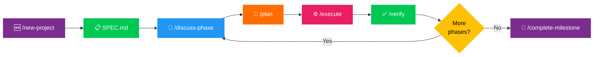

# 🔄 NexusAI Development Workflow Cycle (GSD)

NexusAI uses a structured, subagent-delegated context engineering workflow system based on **Get Shit Done (GSD)**. This workflow prevents context bloat, enforces test-driven empirical verification, and ensures atomic git commits for reliable AI-assisted software engineering.

---

## 📐 Standard Workflow Cycle

---

## 🛠️ Stage Breakdown

| Stage | Command / Artifact | Description |
| :--- | :--- | :--- |
| **1. Initialization** | `🆕 /new-project` $\rightarrow$ `SPEC.md` | Defines project scope, target capabilities, architectural constraints, and requirements. |
| **2. Phase Discussion** | `💬 /discuss-phase` $\rightarrow$ `DECISIONS.md` | Resolves design decisions, API contracts, and structural trade-offs before writing code. |
| **3. Task Planning** | `📐 /plan` $\rightarrow$ `PLAN.md` | Generates structured XML step-by-step implementation plans organized into independent execution waves. |
| **4. Subagent Execution**| `⚙️ /execute` | Dispatches plans to dedicated subagents (`gsd-executor`) running with fresh context windows across git branches. |
| **5. Verification** | `✅ /verify` | Runs empirical tests (`pytest`, `curl`, build commands) to verify task completion before merging. |
| **6. Milestone Complete**| `🏁 /complete-milestone` | Audits completed features, updates roadmap/state docs, and seals the release milestone. |

---

## 🧬 Subagent Delegation & Context Protection

* **Context Isolation:** Subagents run on clean context windows without inheriting excessive chat history, ensuring high AI reasoning quality.
* **Atomic Git Commits:** Every executed task generates an individual git commit immediately upon passing verification.
* **Empirical Proof:** No task is marked complete without hard evidence (test logs, HTTP response codes, or UI render checks).
